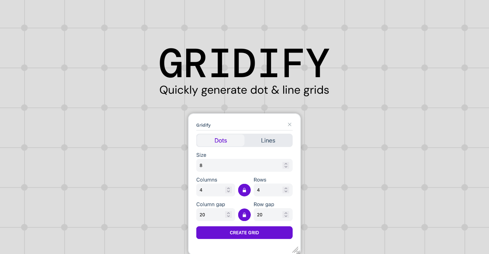

# Gridify Penpot Plugin

This plugin allows you to create grids of dots or lines for your Penpot designs.

# Install on Penpot

Open the plugins modal in your Penpot project and add the next url

- https://penpot-gridify-plugin.netlify.app/manifest.json

Click install and you're setup! you can start generating grids for your designs
